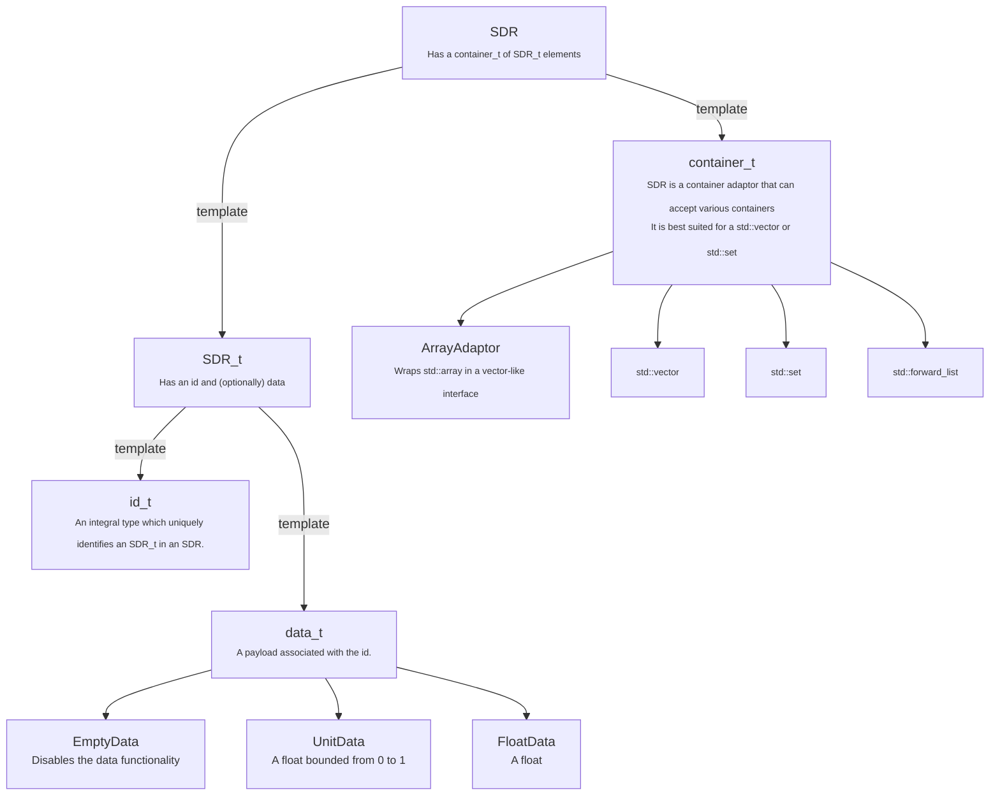

[](https://travis-ci.com/github/jagprog5/sdr)
[](https://codecov.io/gh/jagprog5/sdr)
[](https://opensource.org/licenses/MIT)
# Sparse Distributed Representation (SDR)

This is a header-only C++17 library for manipulating [SDRs](https://youtu.be/ZDgCdWTuIzc).

## Quick Example

```cpp
#include "SparseDistributedRepresentation/SDR.hpp"

using namespace SparseDistributedRepresentation;

int main() {
    SDR a{1, 2, 3, 4};
    SDR b{2, 3, 4, 5};
    std::cout << (a & b) << std::endl; // prints: [2,3,4]
    return 0;
}

```

## Building

### Tests and Fuzzing

```bash
# build
cd build && cmake .. -DBUILD_TESTING=true && cmake --build .

# test
ctest

# or run each test manually
./test_sdr # tests
./fuzz_sdr [<fuzz_amount>] # fuzzy tests
```

### Display Code Coverage

```bash
apt-get install lcov
cd build && cmake .. -DBUILD_TESTING=true -DCODE_COVERAGE=true && make cov-show
```

### Display CPU Profile

```bash
apt-get install libgoogle-perftools-dev  
cd build && cmake .. -DBUILD_TESTING=true -DPERF=CPU && make perf-show
```

# Guide

## Operations

| Operation | Arg1   | Arg2   | Result    |
|-----------|--------|--------|-----------|
| AND       | [1, 2] | [2, 3] | [2]       |
| OR        | [1, 2] | [2, 3] | [1, 2, 3] |
| XOR       | [1, 2] | [2, 3] | [1, 3]    |
| RM        | [1, 2] | [2, 3] | [1]       |

Each operation has three variations:

- normal (*and* elements, "ande")
- size (*and* size, "ands")
- inplace (*and* inplace, "andi")

```cpp
SDR a{1, 2};
SDR b{2, 3};

// and elements
SDR r = a.ande(b);  // a new sdr is created with the result: [2]

// and size
int s = a.ands(b);  // returns 1; this is the size of the result if ande was called

// and inplace
a.andi(b)           // `a` is modified and contains the result [2]
```

## Library Structure



## SDR_t with Data

```cpp
#include "SparseDistributedRepresentation/SDR.hpp"
#include "SparseDistributedRepresentation/DataTypes/UnitData.hpp"

int main() {
    // the SDR contains elements which are identified by an int
    // and each id has a UnitData associated with it
    using UnitSDR_t = SDR_t<int, UnitData>;
    using UnitSDR = SDR<UnitSDR_t>;

    // prints [0(.25)]
    // since both SDRs have an element in the same position (0),
    // and because UnitData multiplies together in the and-op (0.5 * 0.5)
    auto r0 = UnitSDR{UnitSDR_t(0, 0.5)}.ande(UnitSDR{UnitSDR_t(0, 0.5)});
    std::cout << r0 << std::endl;

    // data types also define a "relevance".
    // for UnitData, if its value is < 0.1, then it is omitted from the result
    auto r1 = UnitSDR{UnitSDR_t(0, 0.25)}.ande(UnitSDR{UnitSDR_t(0, 0.25)});
    std::cout << r1 << std::endl; // []
    int r1_size = UnitSDR{UnitSDR_t(0, 0.25)}.ands(UnitSDR{UnitSDR_t(0, 0.25)});
    std::cout << r1_size << std::endl;  // 0

    // data types are compatible with other data types
    // EmptyData converts to UnitData(1)
    auto r2 = UnitSDR{UnitSDR_t(0, 0.5)}.ande(SDR{SDR_t(0)});
    std::cout << r2 << std::endl;  // [0(.50)]
    return 0;
}
```

## Escaping the Walled Garden

If the SDR api is lacking in some niche way, then an SDR can be `reinterpret_cast`ed to its underlying container.

```cpp
SDR a{1, 2, 3};
auto brute_force_ptr = reinterpret_cast<std::vector<SDR_t<>>*>(&a);
(*brute_force_ptr)[1].id = 17;

// SDRs have ascending elements with no duplicates
// this is not a valid SDR since it has [1,17,3]
// it will give strange values but not UB
std::cout << a;
```
