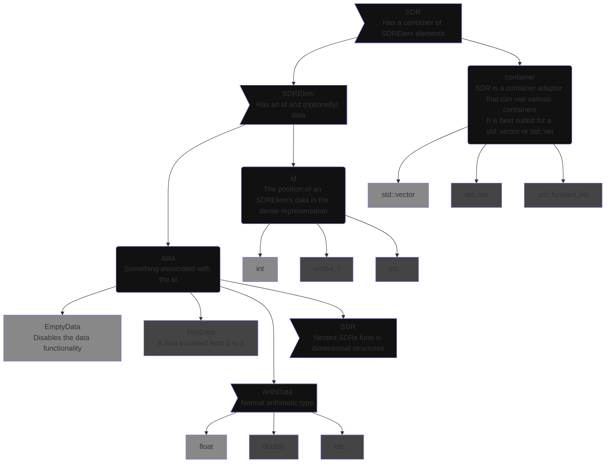

## Library Structure

```mermaid
flowchart TB
    tclass>"Templated Class"]
    tparam("Template Parameter")
    instance["Template Instance"]
    dinst["Default instance"]

    style tparam fill:#111
    style tclass fill:#111
    style instance fill:#444
    style dinst fill:#888
```

```mermaid
flowchart TB
    SDR>"SDR\nHas a container of SDRElem elements"]
    SDRElem>"SDRElem\nHas an id and (optionally) data"]
    container("container\nSDR is a container adaptor that can use various containers\nIt is best suited for a std::vector or std::set")
    EmptyData["EmptyData\nDisables the data functionality"]
    UnitData["UnitData\nA float bounded from 0 to 1"]
    ArithData>"ArithData\nNormal arithmetic type"]
    SDR2>"SDR\nNested SDRs form n-dimensional structures"]
    id("id\nThe position of an SDRElem's data in the dense representation")
    data("data\nSomething associated with the id")

    SDR-->SDRElem
    SDR-->container
    container-->std::vector
    container-->std::set
    container-->std::forward_list

    SDRElem--->data
    SDRElem-->id

    id-->int
    id-->uint64_t
    id-->etc...

    data-->EmptyData
    data-->UnitData
    data--->ArithData
    data-->SDR2

    ArithData-->float
    ArithData-->double
    etc2["etc..."]
    ArithData-->etc2

style SDR fill:#111
style container fill:#111
style SDRElem fill:#111
style id fill:#111
style data fill:#111

style std::set fill:#444
style std::forward_list fill:#444
style UnitData fill:#444
style ArithData fill:#111
style uint64_t fill:#444
style etc... fill:#444
style SDR2 fill:#111

style std::vector fill:#888
style EmptyData fill:#888
style int fill:#888

style float fill:#888
style double fill:#444
style etc2 fill:#444
```